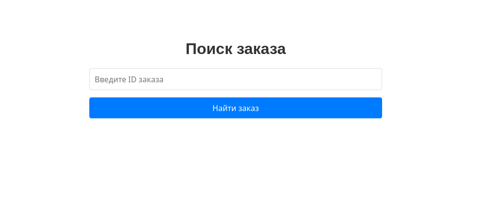

# Демонстрационный сервис обработки и отображения заказов.

## Описание сервиса:

В данное задании создан небольшой микросервис на Golang с использованием базы данных и очереди сообщений. Сервис получает данные заказов из очереди (**Kafka**.), сохраняет их в базу данных (**PostgreSQL**) и кэширует в памяти для быстрого доступа. В качестве кэша использован собственноручно написанный `lru-cache`.    
При перезапуске сервис восстанавливает кеш из БД: при старте сервис заполняет кеш актуальными данными из базы данных, чтобы продолжить обслуживание запросов без задержек.     

Сервис доступен по адресу `localhost:8080`   

Сервис поддерживает простой web-интерфейс, позволяющий получить данные по `order_uid` заказа:



Также сервис поддерживает GET-запросы, возвращающие данные в формате JSON, соответствующего заказа. Например:   
`GET http://localhost:8080/order/<order_uid>` должен вернуть JSON с информацией о заказе.

Для удобства также использована `kafka-ui`, позволющая отслеживать состояние брокера, топика сообщений и доступная по адресу `localhost:9090`.  
Также реализован продюссер сообщений на Golang, который отправляет тестовые сообщения в очередь (**Kafka**).

## Использование
Всё запускается в docker-контейнерах, для их запуска реализованы в Makefile комманды:    

```
  make run          # для старта микросервиса
  make go-producer  # старт продюсера
  make postgres     # запускает postgres
  make kafka        # запускает kafka-ui
  make clean        # останавливает все docker-контейнеры
```
